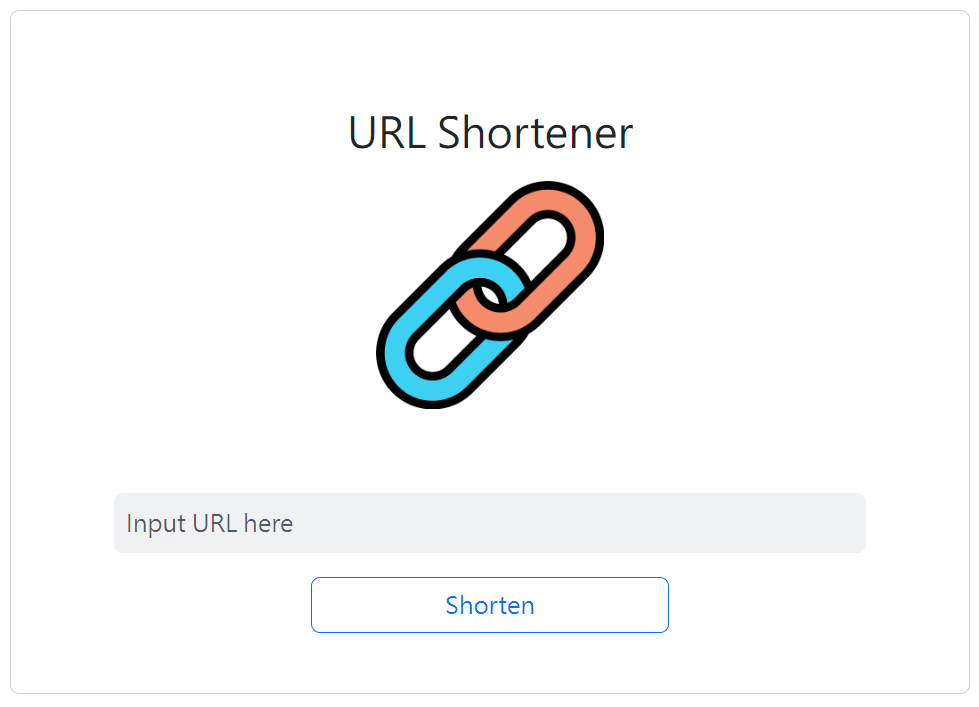
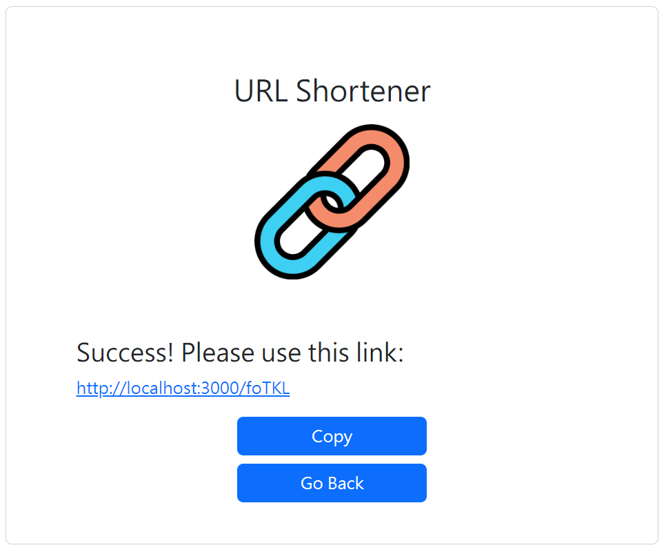

# 短網址產生器

把又長又難記的網址縮短成簡潔的格式！




## 功能

- 輸入網址並產生短網址
- 快速複製產生的短網址

## 開始使用

1. 將專案 clone 到本地

2. 移動到專案資料夾，並輸入

   ```
   npm install
   ```

3. 啟動應用程式

   ```
   npm run start
   ```

4. 打開瀏覽器並進入以下網址

   ```
   http://localhost:3000
   ```

5. 結束應用程式

   ```
   crtl + c
   ```

## 開發工具

- Node.js v18.15.0
- Express.js v4.18.2
- Express-Handlebars v7.1.0
- Bootstrap v5.3.1
